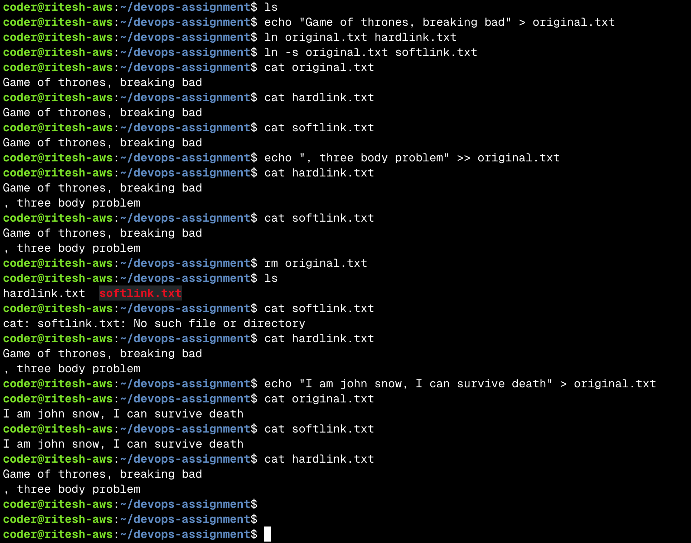
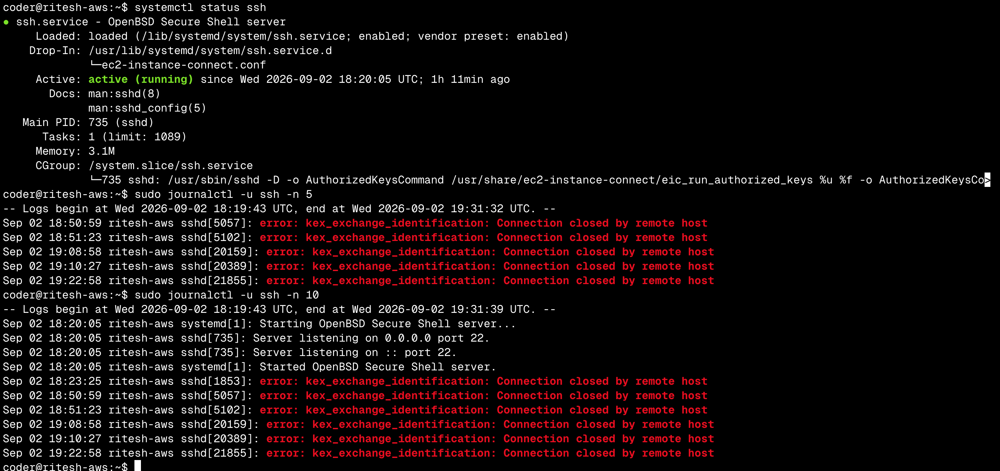

# Linux Fundamentals assignment
Task 1: Soft Link & Hard Link
Learn the difference between soft links and hard links.
Learn the commands to create both.
Practice creating and deleting soft and hard links.
Prepare for this as an interview question.

Hardlink is the same file with another name, Softlink is a file pointing to the file location of the original. 
Hardlink and original share same inode meaning both point to same data on disk. Softlink points to the original file locaion and dosen't know abuot memory block so when original is deleted the softlink becomes broken

Task 2: adduser vs useradd
Learn the difference between adduser and useradd.
Understand which command is preferred on Ubuntu/Linux and why.
Create a test user using the recommended command.

adduser is a user friendly command which sets up everyting in one command while useradd is not very user friendly, for each field you have to hit a new command.

Task 3: journalctl
Learn what journalctl is used for.
Learn how to view system and service logs using journalctl.
Practice checking logs for a specific service.

journalctl is used to print logs of apps or of the whole system

Task 4: Linux Command Cheat Sheet
Review the Linux command cheat sheet.
Practice the important commands covered in the cheat sheet.
Understand the purpose and basic usage of each command.

DONE 🙂