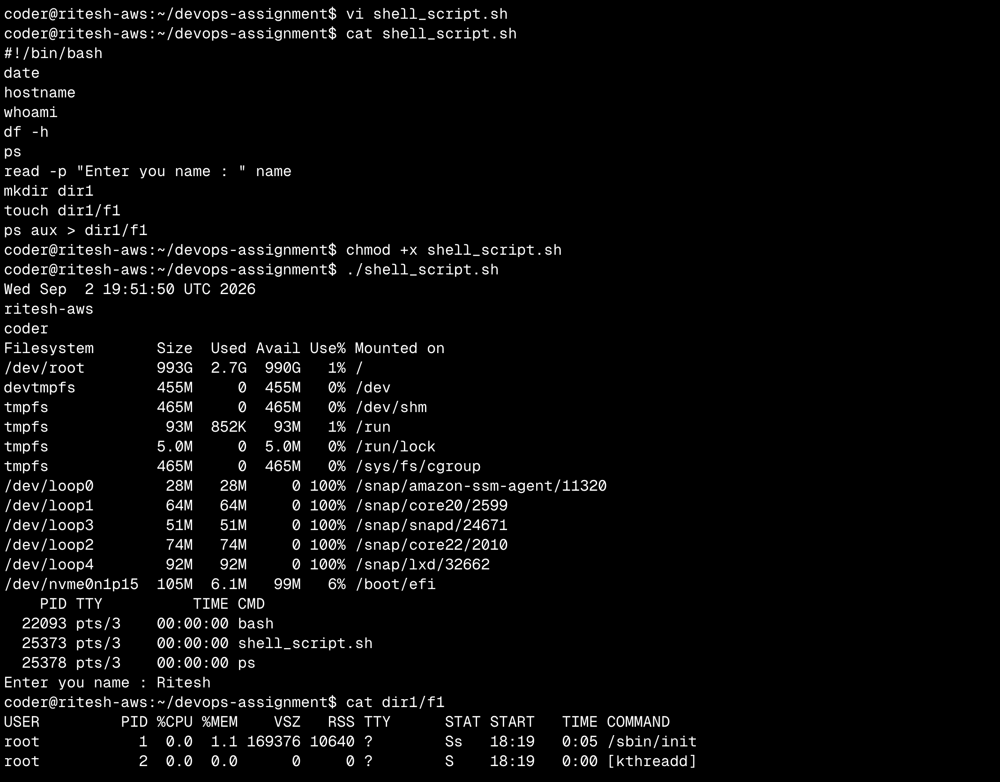

Command output : 
```bash
coder@ritesh-aws:~/devops-assignment$ ./shell_script.sh 
Wed Sep  2 19:51:50 UTC 2026
ritesh-aws
coder
Filesystem       Size  Used Avail Use% Mounted on
/dev/root        993G  2.7G  990G   1% /
devtmpfs         455M     0  455M   0% /dev
tmpfs            465M     0  465M   0% /dev/shm
tmpfs             93M  852K   93M   1% /run
tmpfs            5.0M     0  5.0M   0% /run/lock
tmpfs            465M     0  465M   0% /sys/fs/cgroup
/dev/loop0        28M   28M     0 100% /snap/amazon-ssm-agent/11320
/dev/loop1        64M   64M     0 100% /snap/core20/2599
/dev/loop3        51M   51M     0 100% /snap/snapd/24671
/dev/loop2        74M   74M     0 100% /snap/core22/2010
/dev/loop4        92M   92M     0 100% /snap/lxd/32662
/dev/nvme0n1p15  105M  6.1M   99M   6% /boot/efi
    PID TTY          TIME CMD
  22093 pts/3    00:00:00 bash
  25373 pts/3    00:00:00 shell_script.sh
  25378 pts/3    00:00:00 ps
Enter you name : Ritesh
```